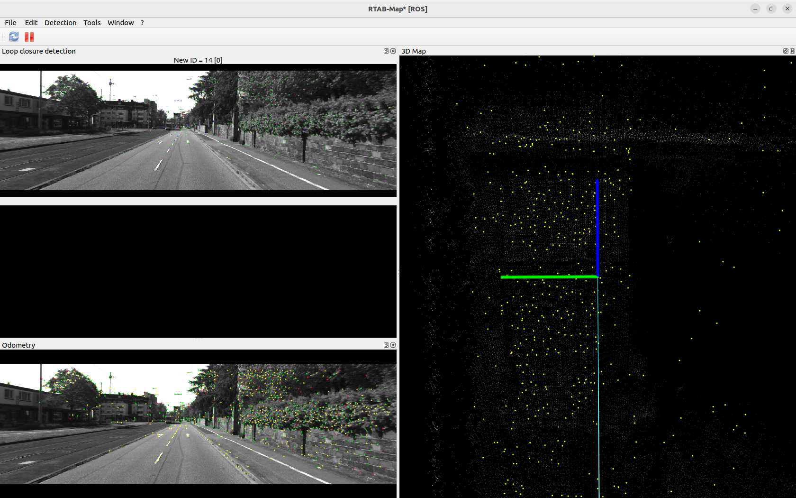
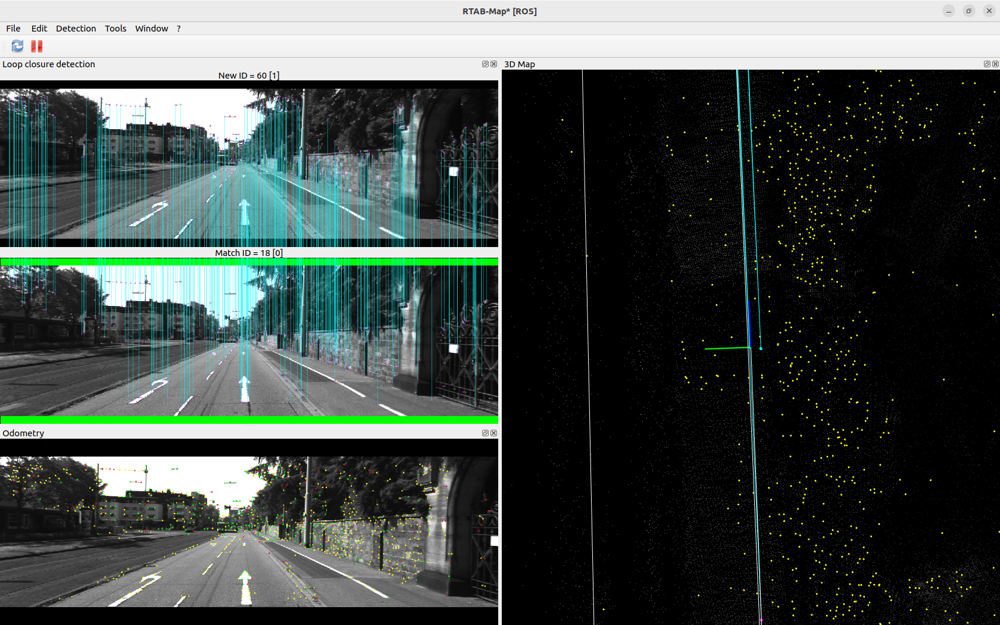
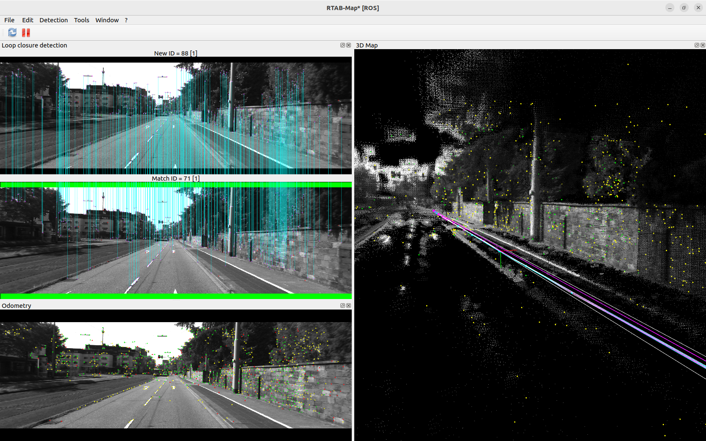

# SLAM Vision - ROS2 with KITTI Dataset


A Visual SLAM implementation using RTAB-Map in stereo mode with the KITTI odometry dataset, built on ROS2 Humble.

## Demo




## Stack
- Ubuntu 22.04
- ROS2 Humble
- RTAB-Map (Stereo mode)
- KITTI Raw Dataset (2011_09_26_drive_0002)
- Custom ROS2 stereo image publisher

## How it works
1. KITTI stereo images are published as ROS2 topics by `kitti_publisher.py`
2. RTAB-Map receives left/right images and camera info
3. Stereo odometry tracks camera motion frame by frame
4. 3D point cloud map is built in real time
5. Loop closure detection corrects drift when revisiting locations

## Run
Terminal 1 - Launch RTAB-Map:
```bash
ros2 launch rtabmap_launch rtabmap.launch.py \
    stereo:=true \
    left_image_topic:=/stereo_camera/left/image_raw \
    right_image_topic:=/stereo_camera/right/image_raw \
    left_camera_info_topic:=/stereo_camera/left/camera_info \
    right_camera_info_topic:=/stereo_camera/right/camera_info \
    frame_id:=left_camera
```

Terminal 2 - Run publisher:
```bash
python3 scripts/kitti_publisher.py
```
